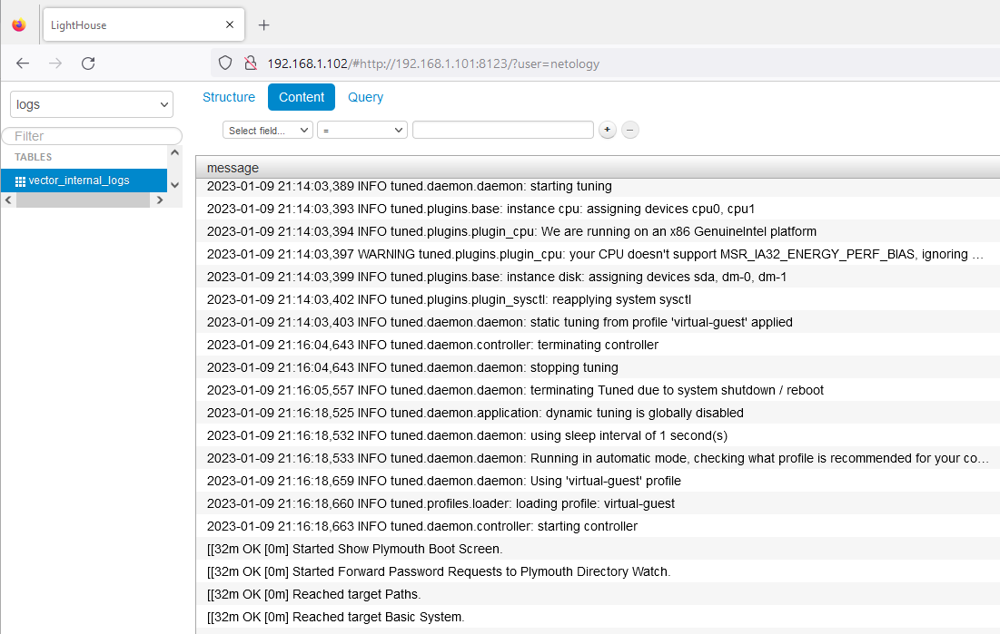

#  Домашнее задание "Работа с roles" 
---
Для скачивания ролей использовать команду:   

#### ansible-galaxy install -r requirements.yml -p roles  


Совместно проигранные роли в одном плейбуке создадут и сконфигурируют тестовую базу clickhouse, коллектор Vector и прсмотрщик логов lighthouse.   
    
requirements.yml
```
- name: clickhouse
  src: https://github.com/devops-run/clickhouse-role.git
  scm: git
  version: main

- name: vector
  src: https://github.com/devops-run/vector-role.git 
  scm: git
  version: main

- name: lighthouse
  src: https://github.com/devops-run/lighthouse-role.git
  scm: git
  version: main
```
http://192.168.1.102/#http://192.168.1.101:8123/?user=netology



#### Ссылки на репозитории:       
[clickhouse-role](https://github.com/devops-run/clickhouse-role)

[lighthouse-role](https://github.com/devops-run/lighthouse-role)

[vector-role](https://github.com/devops-run/vector-role)


