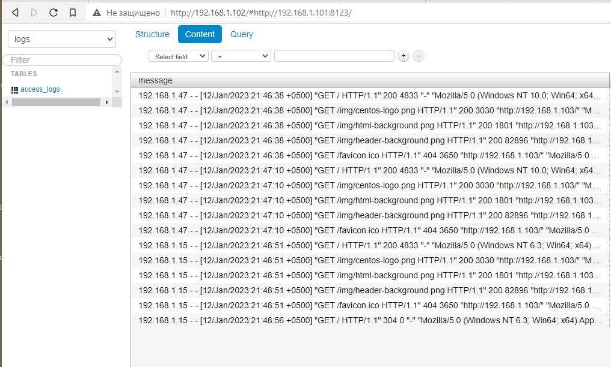

# Репозиторий ролей Ansible 
---
Для скачивания ролей использовать команду:   

#### ansible-galaxy install -r requirements.yml -p roles --force 

Для скачивания конкретной роли редактировать файл requirements.yml

Плейбук разбит на 4 автонмных роли. Каждая роль может выполняться отдельно.

Совместно проигранные роли в одном плейбуке создадут и сконфигурируют тестовую базу clickhouse, коллектор Vector и прсмотрщик логов lighthouse.

site.yml
```
- name: clickhouse
  src: https://github.com/devops-run/ansible-roles.git
  scm: git
  version: main
  name: clickhouse

- name: vector
  src: https://github.com/devops-run/ansible-roles.git 
  scm: git
  version: main
  name: vector

- name: nginx
  src: https://github.com/devops-run/ansible-roles.git
  scm: git
  version: main
  name: nginx  

- name: lighthouse
  src: https://github.com/devops-run/ansible-roles.git
  scm: git
  version: main
  name: lighthouse
```


